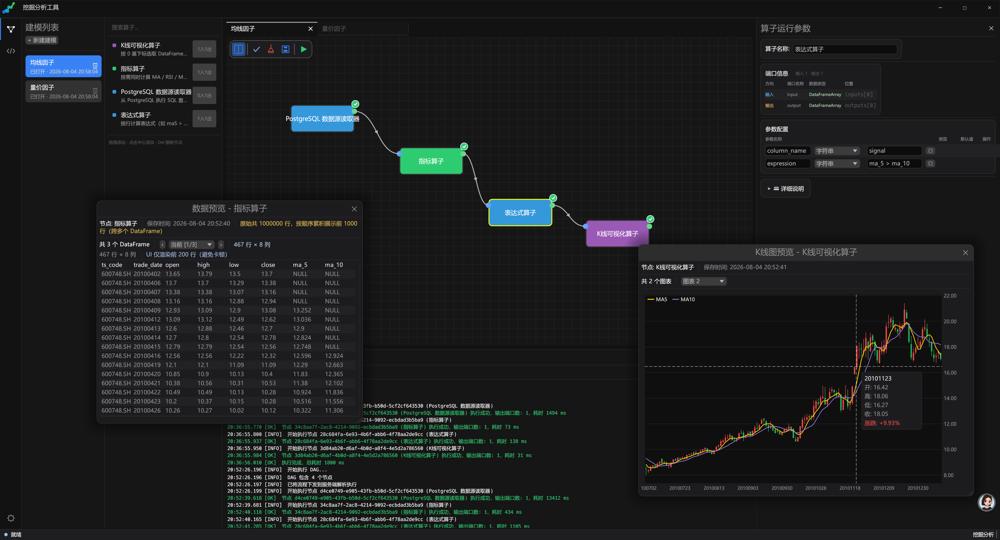

# 青萝 Qinglo · 量化因子挖掘与可视化编排平台

一个面向**量化金融因子挖掘与分析**的桌面平台，使用 Rust 编写。用户在图形界面中通过拖拽节点、连线的方式构建数据流水线（DAG），每 个节点对应一个动态加载的算子（DLL）。平台内置从**数据接入 → 指标计算 → 因子运算 → 信号生成 → 可视化**的完整算子链路，并支持动态编译 Rust 代码自定义算子与 LLM 流式对话算子。

> 名字取自「青萝」——藤蔓攀援生长，喻指因子在 DAG 中逐节点生长、级联传导。

[](https://www.apache.org/licenses/LICENSE-2.0)
[](https://www.rust-lang.org/)
[](#)

---

## 🖥️ 界面预览



---

## ✨ 核心能力

### 量化挖掘分析

| 能力 | 说明 |
| --- | --- |
| **多 Tab DAG 可视化编排** | 拖拽创建节点、端口连线、画布缩放/平移、节点选中等交互；每张 DAG 即一个独立的量化建模，可多开并行编辑 |
| **磁盘建模管理** | 建模持久化到本地，支持新建 / 重命名 / 删除（软删除可恢复）、历史列表懒加载 |
| **两种执行模式** | 「执行 DAG」跑整张图；右键「运行到此结点」仅执行目标节点的上游子图，便于分段调试因子链 |
| **实时执行进度** | 服务端流式推送每个节点的 `Executing → Completed/Failed` 状态，画布即时高亮「运行到哪个算子」 |
| **三类运行日志** | 底部面板分页展示：操作提醒 / 算子运行进度 / 客户端↔服务端 JSON 通信报文原文 |
| **数据预览** | 任意节点输出 `DataFrame` / `DataFrameArray` 预览浮动窗（前 N 行） |
| **K 线图预览** | 蜡烛图 + MA5/MA10 折线 + 坐标轴 + 缩放滚动 + 十字光标，按股票代码分 tab 切换 |
| **折线图预览** | 按 `date/close` 列渲染收盘价折线，支持十字光标 tooltip |
| **算子参数面板** | 选中自定义算子节点时，右侧面板展示端口定义、参数编辑与算子文档（Markdown） |
| **算子分类树** | 左侧算子面板按层级分类展示全部可用算子，支持搜索过滤，后台线程周期刷新 |

### 算子能力（内置 8 个，分 5 类）

| 类别 | 算子 | 功能 |
| --- | --- | --- |
| 📥 **数据源** | PostgreSQL 数据源读取器 | 执行 SQL 查询，结果转 `DataFrame` / `DataFrameArray`，支持排序、分组、动态类型推断 |
| 📈 **技术指标** | 指标算子 | 一次性计算 **MA / RSI / MACD**（参数非空即计算，可同时输出多指标列） |
| 🔢 **因子运算** | 累加算子 | 对指定列行向 `cumsum`，支持结果列名、空值跳过、Float64/Int64 |
| | 前移加算子 | 源列前移 n 行（pandas `shift`）后逐列相加，类型自动提升 |
| | 表达式算子 | 内置词法/语法分析器，逐行计算布尔表达式（如 `ma5 > ma10 && rsi_14 < 30`），成立写 1 |
| 🖼️ **可视化** | K 线可视化算子 | 按下标选取子数组，提取 OHLC/MA 列生成自定义 DSL，前端渲染为蜡烛图 |
| | 折线可视化算子 | 按下标选取子数组透传，前端按 `date/close` 渲染收盘价折线图 |
| 🤖 **AI** | ollama 流式对话算子 | 对接本地 ollama，逐 token 流式输出 LLM 生成内容，无外部 HTTP 依赖 |

> 所有算子均以 `cdylib` 形式编译，体积小、无重型依赖（不依赖 polars/arrow），支持动态加载与热更新。

### 系统特性

- **动态编译**：在 GUI 中编写 Rust 算子代码，一键编译为 DLL 并注册到算子库
- **参数注入**：算子参数自动生成为 Rust 常量注入到用户代码头部
- **流式执行**：算子可声明 `stream=true`，导出 `stream_start / stream_next / stream_end` C ABI 符号；服务端识别流式子图链头，逐 chunk 拉取并级联传播给下游流式节点
- **拓扑调度**：服务端对 DAG 做拓扑排序后逐节点执行，节点输出缓存供下游复用，任一节点失败即停止
- **轻量运行时**：自研列式 `DataFrame` / `ColumnData` / `PortData`，替代 polars/arrow 等重型库，编译快、DLL 小

---

## 架构图

```
┌─────────────────────────────────────────────────────────────────┐
│                     mining-app (GUI 前端)                        │
│  ┌──────────┐ ┌──────────┐ ┌──────────┐ ┌──────────────────┐   │
│  │  DAG 画布 │ │ 代码编辑器│ │  调试器   │ │   参数面板       │   │
│  └────┬─────┘ └────┬─────┘ └────┬─────┘ └────────┬─────────┘   │
│       │             │            │                 │             │
│       └─────────────┴────────────┴─────────────────┘             │
│                          │                                       │
│               operator_executor.rs                               │
│               (DAG 执行调度 / TCP 客户端 / 子图下发)              │
└───────────────────────────┬─────────────────────────────────────┘
                            │ TCP (4 字节长度前缀 + JSON 帧协议)
                            │  ExecuteDag / DagNodeProgress / StreamChunk
                            ▼
┌─────────────────────────────────────────────────────────────────┐
│              operator_runtime_server (后端服务)                   │
│  ┌─────────────────────────────────────────────────────────┐     │
│  │  RuntimeState: 算子注册表 / 请求 ID 分配                  │     │
│  │  execute_dag: 拓扑排序 → 预解析 DLL → 探测流式能力         │     │
│  │    → 批量节点逐个执行 / 流式子图级联传播 chunk             │     │
│  │    → 实时推送 NodeProgress + StreamChunk                  │     │
│  └─────────────────────────────────────────────────────────┘     │
│                            │                                     │
│                    operator_sdk (算子 SDK)                       │
│              (DLL 加载 / 代码编译 / 执行调度 / 流式 ABI)         │
│                            │                                     │
│                    operator_runtime (核心运行时)                 │
│         (DataFrame / ColumnData / PortData / 协议定义)           │
└─────────────────────────────────────────────────────────────────┘
                            │
                            ▼
              算子 DLL (cdylib, 用户自定义)
              ┌─────────────────────────────────────┐
              │  execute_operator() -> i32           │  批量执行
              │  execute_operator_stream_start/next  │  流式执行
              │    /end (stream=true 算子可选)       │
              │  输入: PortData* 数组                │
              │  输出: PortData* 数组                │
              └─────────────────────────────────────┘
```

---

## 模块详解

### 1. `operator_runtime` — 核心运行时基础库

**路径**: `operator_runtime/` · **类型**: `dylib` + `rlib` · **依赖**: serde, serde_json, tokio, chrono, base64

定义轻量级列式数据结构 `DataFrame` / `ColumnData` 与算子间通用端口数据 `PortData`（支持 Float / Int / String / Bool / DataFrame / DataFrameArray），定义 TCP 通信协议 `RuntimeRequest` / `RuntimeResponse`，并导出 `operator_runtime_version()` 供 DLL 版本检查。

| 结构体 | 说明 |
|--------|------|
| `DataType` | 数据类型枚举（Float64, Int64, String, Bool, Null） |
| `ColumnData` | 列式存储，紧凑二进制 + null 位图 |
| `DataFrame` | 轻量级表数据，由多个 `ColumnData` 组成 |
| `PortData` | 端口数据枚举，算子间传递的统一格式（含 `DataFrameArray` 支持分组多表） |
| `DagDefinition` | 可序列化的完整 DAG 定义（节点 + 边），用于整体下发 |
| `RuntimeRequest` | 请求枚举（Ping / LoadOperator / ExecuteNode / CompileAndExecute / ExecuteDag / ExecuteStream 等） |
| `RuntimeResponse` | 响应枚举（含 `DagNodeProgress` 节点进度推送、`StreamChunk` 流式 chunk 推送） |

### 2. `operator_sdk` — 算子开发 SDK

**路径**: `operator_sdk/` · **类型**: `rlib` · **依赖**: libloading, serde, operator_runtime

提供算子 DLL 动态加载、Rust 代码实时编译、参数常量注入、算法名清理与 DLL 路径查找。

| 函数 | 说明 |
|------|------|
| `find_crate_dll()` | 在 deps 目录中查找指定 crate 的 DLL |
| `sanitize_algorithm_name()` | 清理算法名称中的非法字符 |
| `generate_param_constants()` | 根据参数定义生成 Rust 常量代码 |
| `inject_params_into_code()` | 将参数常量注入到用户代码头部 |
| `cargo_project_build()` | 使用 cargo 编译临时 Rust 项目 |
| `execute_native_operator()` | 执行预编译的 Rust 原生算子 |
| `compile_and_execute()` | 编译并执行用户代码 |

### 3. `operator_executor_client` — 执行器客户端库

**路径**: `operator_executor_client/` · **类型**: `rlib` · **依赖**: operator_runtime, operator_sdk, serde_json, thiserror

重新导出 `operator_sdk` 的公共 API，提供 TCP 客户端 `RuntimeClient`，实现帧协议（4 字节长度前缀 + JSON 载荷），支持同步阻塞调用（便于在 GUI 线程中通过 `spawn_blocking` 使用）。

| 结构体/函数 | 说明 |
|------------|------|
| `RuntimeClient::execute_dag()` | 下发完整 DAG，服务端解析拓扑后按序执行 |
| `RuntimeClient::execute_dag_with_progress()` | 同上，并回调每个节点的执行进度 |
| `RuntimeClient::execute_dag_streaming()` | 同上，并回调节点进度 + 流式 chunk（LLM token 等） |
| `spawn_runtime_server()` | 启动 runtime 子进程 |

### 4. `operator_runtime_server` — Runtime 后端服务

**路径**: `operator_runtime_server/` · **类型**: 可执行文件 · **依赖**: operator_runtime, operator_sdk, tokio, serde, parking_lot

启动异步 TCP 服务（默认 `127.0.0.1:17890`），管理算子注册表 `RuntimeState`，分发处理客户端请求。

**DAG 执行流程**（`execute_dag`）：

```
客户端 ExecuteDag → 读帧解析 → topological_sort_dag
  → 预解析所有节点 DLL + 探测流式能力(streaming_capable)
  → 按拓扑序遍历：
       流式子图链头 → execute_streaming_subgraph 逐 chunk 拉取并级联传播
                    → 推送 DagEvent::StreamChunk
       批量节点     → 收集上游输出 → execute_operator → 缓存输出供下游
                    → 推送 DagEvent::NodeProgress(Executing/Completed/Failed)
  → 任一节点失败即停止，已完成结果仍返回
  → 推送终止帧 DagExecuted
```

支持的请求：`Ping` / `Shutdown` / `LoadOperator` / `UnloadOperator` / `ExecuteNode` / `ExecuteDll` / `CompileAndExecute` / `ListOperators`（层级分类树）/ `ExecuteDag`（流式进度 + chunk）/ `ExecuteStream`（独立单节点流式）。

### 5. `mining-app` — GUI 前端应用

**路径**: `mining-app/` · **类型**: 可执行文件 · **依赖**: eframe, egui, tokio, serde, libloading, operator_runtime, operator_executor_client

基于 egui 的桌面 GUI，采用 Trae / VS Code 风格深色主题（自定义标题栏 + 左侧活动栏 + 底部状态栏 + 圆角控件），内置中文字体自动探测。

**三大视图**（左侧活动栏切换）：

| 视图 | 说明 |
|------|------|
| 挖掘分析 (`MiningAnalysis`) | 主视图：左侧建模列表 + 算子分类面板 + 中央 DAG 画布 + 右侧算子参数面板 + 底部运行日志，支持多 Tab |
| 算子开发 (`OperatorDevelopment`) | 编写 Rust 算子代码、配置端口参数、Debug 诊断、一键编译为 DLL 注册到系统 |
| 设置 (`Settings`) | Rust 工具链路径、编译目录配置（自动检测 / 测试连接 / 保存） |

**子模块**：

| 模块 | 文件 | 说明 |
|------|------|------|
| `config` | `config.rs` | 应用配置（Rust 工具链路径、编译目录、算子目录） |
| `dag` | `dag.rs` | DAG 数据模型（节点、边、算子类型、拓扑排序、I/O 注册表、算子分类缓存） |
| `dag_store` | `dag_store.rs` | 建模磁盘持久化（增删改查、软删除恢复） |
| `operator_executor` | `operator_executor.rs` | 算子执行引擎（DAG → 下发定义、子图构造、DLL 路径解析、后台执行任务） |
| `debug_executor` | `debug_executor.rs` | Debug 模式执行器（编译诊断、性能分析） |
| `ui::mining_analysis_view` | `ui/mining_analysis_view.rs` | 挖掘分析主视图 |
| `ui::operator_development_view` | `ui/operator_development_view.rs` | 算子开发视图 |
| `ui::dag_canvas` | `ui/dag_canvas.rs` | DAG 画布（节点拖拽、连线、缩放、右键菜单） |
| `ui::code_editor` | `ui/code_editor.rs` | 代码编辑器组件 |
| `ui::operator_params_editor` | `ui/operator_params_editor.rs` | 算子参数编辑器 + 文档展示 |
| `ui::kline_chart_view` | `ui/kline_chart_view.rs` | K 线图渲染（蜡烛图 + MA 折线） |
| `ui::line_chart_view` | `ui/line_chart_view.rs` | 折线图渲染 |
| `ui::settings_view` | `ui/settings_view.rs` | 设置视图 |
| `ui::state` | `ui/state.rs` | UI 全局状态（多 Tab、后台执行任务、三类日志） |
| `ui::theme` | `ui/theme.rs` | 深色主题色板 |

**DAG 模型核心概念**：

| 概念 | 说明 |
|------|------|
| `Node` | DAG 节点，含算子类型与画布坐标 |
| `Edge` | DAG 边，连接源节点输出端口 → 目标节点输入端口 |
| `OperatorType` | 算子类型（当前为 `Custom(CustomOperatorDef)`，含端口定义、代码、颜色、文档） |
| `NodeIORegistry` | 节点 I/O 全局注册表，集中管理输入、输出、执行状态与缓存失效（脏节点） |
| `ExecutionStatus` | 执行状态（Pending / Executing / Success / Failed / Stale） |
| `DagExecTask` | 后台执行任务，工作线程通过 mpsc 回传 `Log` / `NodeProgress` / `Finished` 消息 |

### 6. `operator/*` — 内置算子库

每个算子目录包含 `src/lib.rs`（实现）、`operator.json`（元数据：名称、描述、端口定义、Markdown 文档、颜色）、`Cargo.toml`。算子面板通过服务端 `ListOperators` 获取层级分类树并展示。

详见上方「算子能力」表格。每个算子的 `operator.json` 内含完整 `description_md` 文档，GUI 参数面板会原样渲染。

---

## 依赖关系图

```
operator_runtime (基础数据类型 + 协议)
    ▲
    │
operator_sdk (DLL 加载 + 编译执行 + 流式 ABI)
    ▲          ▲
    │          │
operator_executor_client    operator_runtime_server
(TCP 客户端桥接)            (TCP 服务端 + DAG 调度)
    ▲                     ▲
    │                     │
mining-app (GUI 前端) ────┘

operator/* (8 个内置算子)
    ▲
    │ (依赖)
operator_runtime + operator_executor_client
```

---

## 快速开始

### 环境要求

- Rust 稳定版（建议 1.70+）
- C++ 构建工具（cdylib 的 C ABI 兼容）
- Windows: MSVC 工具链

### 构建

```bash
# 构建整个工作区
cargo build

# 发布模式（推荐，strip 符号 + opt-level=3）
cargo build --release
```

### 运行

```bash
# 方式一：直接运行 GUI 应用（会自动尝试启动 runtime）
cargo run -p mining-app

# 方式二：分别启动 runtime 和 GUI
cargo run -p operator_runtime_server    # 终端 1：启动服务（127.0.0.1:17890）
cargo run -p mining-app                 # 终端 2：启动 GUI
```

### 典型量化挖掘工作流

1. **接入数据**：拖入「PostgreSQL 数据源读取器」，配置连接参数与 SQL，按 `ts_code` 分组返回 `DataFrameArray`
2. **计算指标**：连接「指标算子」，配置 `ma_periods=5,10,20` / `rsi_period=14` / `macd_fast=12,macd_slow=26,macd_signal=9`
3. **生成信号**：连接「表达式算子」，编写 `ma5 > ma10 && rsi_14 < 30`，结果写入 `signal` 列
4. **因子运算**：按需串联「累加算子」「前移加算子」做累计 / 滞后处理
5. **可视化验证**：连接「K 线可视化算子」/「折线可视化算子」，右键节点预览图表
6. **执行调试**：点击「执行 DAG」跑整图，或右键某节点「运行到此结点」分段调试；底部日志面板查看进度与通信报文

---

## 开发自定义算子

1. 在 GUI「算子开发」视图中编写 Rust 代码
2. 定义端口参数（输入、输出、参数）
3. 点击「编译并调试」测试
4. 点击「启用算子」将其编译为 DLL 并注册到系统（立即出现在算子面板）

算子模板（动量因子计算）：

```rust
use operator_runtime::{PortData, DataFrame};
use std::slice;

// 参数由 GUI 自动注入
const PARAM_PERIOD: f64 = 5.0;

#[no_mangle]
pub extern "C" fn execute_operator(
    inputs: *const *const PortData,
    outputs: *mut *mut PortData,
    _params_json: *const std::os::raw::c_char,
) -> i32 {
    // 扫描输入
    let mut input_count = 0;
    unsafe {
        while !inputs.add(input_count).read().is_null() {
            input_count += 1;
        }
    }

    // 获取输入数据
    let input_data = unsafe { slice::from_raw_parts(inputs, input_count) };
    let input_df = match unsafe { &*input_data[0] } {
        PortData::DataFrame(df) => df,
        _ => return 0,
    };

    // 计算动量因子
    let col = input_df.column("value").unwrap();
    let values: Vec<f64> = col.to_f64_vec()
        .into_iter().map(|v| v.unwrap_or(0.0)).collect();

    let period = PARAM_PERIOD as usize;
    let mut momentum = Vec::with_capacity(values.len());
    for i in 0..values.len() {
        if i >= period && values[i - period] != 0.0 {
            momentum.push((values[i] - values[i - period]) / values[i - period]);
        } else {
            momentum.push(0.0);
        }
    }

    // 输出结果
    let result = DataFrame::from_f64_vec("momentum", momentum);
    unsafe {
        *outputs = Box::into_raw(Box::new(PortData::DataFrame(result)));
        *outputs.add(1) = std::ptr::null_mut(); // NULL 结束标记
    }
    0
}
```

### 流式算子（可选）

声明 `stream: true` 并额外导出 5 个 C ABI 符号，即可让算子以流式方式执行（如 LLM 逐 token 输出）：

- `execute_operator_stream_start`：建立连接 / 初始化资源
- `execute_operator_stream_next`：读取下一 chunk（如一行 NDJSON 解析为 token）
- `execute_operator_stream_end`：关闭连接 / 释放资源
- `push` / `push_end`：作为流式下游时接收上游 chunk（链头算子返回错误即可）

服务端 `execute_dag` 会识别流式链头，逐 chunk 拉取并级联传播给下游流式节点，实时推送 `StreamChunk` 帧。参考 `operator/ollama_operator` 实现。

---

## 技术约束

| 约束 | 说明 |
|------|------|
| 数据格式 | 算子间数据传递必须使用 `PortData` / `DataFrame`（禁止回调） |
| DLL 格式 | 算子 DLL 必须使用 `cdylib` 格式 |
| 动态链接 | 依赖库使用 `-C prefer-dynamic` 动态链接，避免重复包含 |
| LTO | 不使用 LTO（动态链接与 LTO 不兼容） |
| Panic 策略 | 使用默认 `panic=unwind`，确保算子与 runtime 链接兼容 |
| 轻量优先 | 不依赖 polars/arrow 等重型库，自研列式结构，DLL 体积小、编译快 |
| 表达式引擎 | 内置词法/语法分析，无外部表达式依赖 |

---

## 项目结构

```
Qinglo/
├── Cargo.toml                      # 工作区根配置
├── .cargo/config.toml              # 全局编译配置（动态链接）
├── mining-app/                     # GUI 前端应用
│   ├── src/
│   │   ├── main.rs                 # 入口（标题栏 / 活动栏 / 状态栏 / 视图切换）
│   │   ├── config.rs               # 配置管理
│   │   ├── dag.rs                  # DAG 数据模型 + 算子分类缓存
│   │   ├── dag_store.rs            # 建模磁盘持久化
│   │   ├── operator_executor.rs    # 算子执行引擎（DAG 下发 / 子图）
│   │   ├── debug_executor.rs       # 调试执行器
│   │   └── ui/                     # UI 组件
│   │       ├── mining_analysis_view.rs
│   │       ├── operator_development_view.rs
│   │       ├── dag_canvas.rs
│   │       ├── code_editor.rs
│   │       ├── operator_params_editor.rs
│   │       ├── kline_chart_view.rs
│   │       ├── line_chart_view.rs
│   │       ├── settings_view.rs
│   │       ├── state.rs
│   │       └── theme.rs
│   └── Cargo.toml
├── operator_runtime/               # 核心运行时库
│   ├── src/{lib.rs, protocol.rs}
│   └── Cargo.toml
├── operator_sdk/                   # 算子 SDK（DLL 加载 + 编译 + 流式 ABI）
│   ├── src/lib.rs
│   └── Cargo.toml
├── operator_executor_client/      # 执行器客户端库（TCP 客户端）
│   ├── src/{lib.rs, runtime_client.rs}
│   └── Cargo.toml
├── operator_runtime_server/        # Runtime 后端服务（DAG 拓扑调度 + 流式）
│   ├── src/main.rs
│   └── Cargo.toml
└── operator/                       # 内置算子库
    ├── datasource_operator/        # PostgreSQL 数据源读取器
    ├── indicator_operator/         # MA / RSI / MACD 技术指标
    ├── cumsum_operator/            # 行向累加
    ├── shift_add_operator/         # 前移加
    ├── expression_operator/        # 布尔表达式
    ├── kline_visualization_operator/  # K 线可视化
    ├── line_chart_operator/        # 折线可视化
    └── ollama_operator/            # ollama 流式对话
```

## License

本项目基于 [Apache License 2.0](LICENSE) 开源。

```
Copyright 2026 Jhxke

Licensed under the Apache License, Version 2.0 (the "License");
you may not use this file except in compliance with the License.
You may obtain a copy of the License at

    http://www.apache.org/licenses/LICENSE-2.0

Unless required by applicable law or agreed to in writing, software
distributed under the License is distributed on an "AS IS" BASIS,
WITHOUT WARRANTIES OR CONDITIONS OF ANY KIND, either express or implied.
See the License for the specific language governing permissions and
limitations under the License.
```
